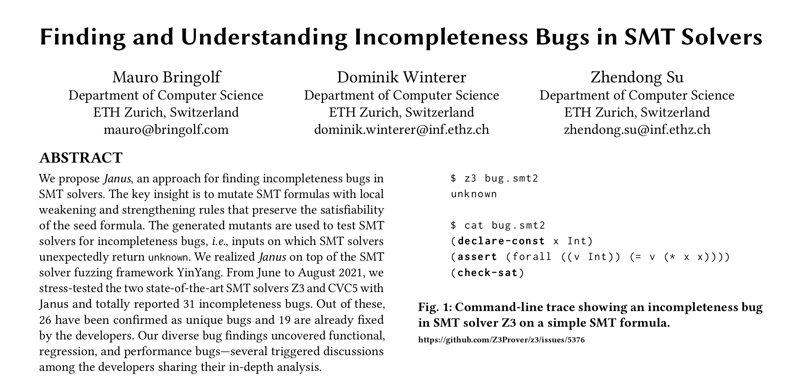

<p align="center"><a></a></p>
</a></p>
<br>
<p align="center">
    <a href="https://github.com/testsmt/janus/actions" alt="Build status">
        </a>
    <a href="https://github.com/psf/black" alt="Documentation">
        </a>
    <a href="https://opensource.org/licenses/MIT" alt="License">
        </a>
    <a href="https://twitter.com/testsmtsolvers" alt="Social">
        </a>
</p>


janus
------------
A tool for testing SMT solver for incompleteness bugs, i.e., unexpected unknown-results. janus has found dozens of incompleteness bugs in in the two state-of-the-art SMT solvers Z3 and cvc5. 

**Incompleteness bugs:** janus can find two types of incompleteness bugs, regression incompleteneses and implication incompletenesses. Regression incompletenesses are caused by (recent) code changes leading to an incompleteness on previously decided formulas. Typically they affect client software that worked correctly with an older version of the SMT solver but fails after updating the SMT solver. Implication incompletenesses occur when an SMT solver can decide a given input formula but minor changes in the formula cause the solver to report unknown. Such formula pairs can suggest possible improvements for SMT solvers, e.g., to formula rewriters, pre-processors, theory solvers etc. 

janus is part of the [YinYang project](testsmt.github.io) and its codebase is based on a fork of the SMT solver testing framework yinyang.


Installation
-------------

``` bash                                                                           
git clone https://github.com/testsmt/janus.git
pip3 install antlr4-python3-runtime==4.9.2
``` 

Note that you may want to add `janus/bin` to your PATH, for running janus conveniently without prefix.  

Usage
------

1. **Get pre-processed SMT-LIB 2 seeds**. 
Clone the repository `https://github.com/testsmt/semantic-fusion-seeds` to obtain pre-processed SMT-LIB files (sat/unsat). Alternatively, you can download and pre-process benchmarks directly from the [SMT-LIB website](http://smtlib.cs.uiowa.edu/benchmarks.shtml) or supply your own benchmarks.

2. **Get and build SMT solvers** for testing. Install two or more [SMT solvers](http://smtlib.cs.uiowa.edu/solvers.shtml) that support the SMT-LIB 2 format. You may find it convenient to add them to your PATH.

3. **Run janus** on the benchmarks e.g. with Z3 and cvc5. 

    a.) Regression incompleteness mode  

    ```bash 
    janus "z3" -cr "z3-4.8.10" -o sat examples/phi1.smt2
    ```

    b.) Implication incompleteness mode 

    ```bash
    janus "z3" -o sat examples/phi1.smt2
    ```

Execute `janus --help` for more information.


Further Details
-------------

For the details on the internals of janus, read our ASE '22 paper. In it we describe **Weakening & Strengthening** which is the underlying technique behind janus, how we used janus in an incompleteness bug hunting campaign for Z3 and cvc5 etc.

<a href="https://testsmt.github.io/papers/bringolf-winterer-su-ase22.pdf">
    
</a>
<br /><br />

You can view all bugs reported with janus via the following [link](https://testsmt.github.io/janus.html). The research and tool was conducted and developed as part of Mauro Bringolf's master thesis with the [AST Lab](https://ast.ethz.ch/) at ETH Zurich. 

Feedback
---------
For bugs/issues/questions/feature requests please file an issue. We are always happy to receive your feedback or help you adjust janus to the needs of your custom solver, help you build on, compare against, help integrate janus.  

📬 [Contact us](https://yinyang.readthedocs.io/en/latest/building_on.html#contact)


Additional Resources
----------
- [Mauro Bringolf's thesis](https://www.research-collection.ethz.ch/handle/20.500.11850/507582)
- [Project yinyang website](https://testsmt.github.io/) with bug statistics, talk videos, etc.
